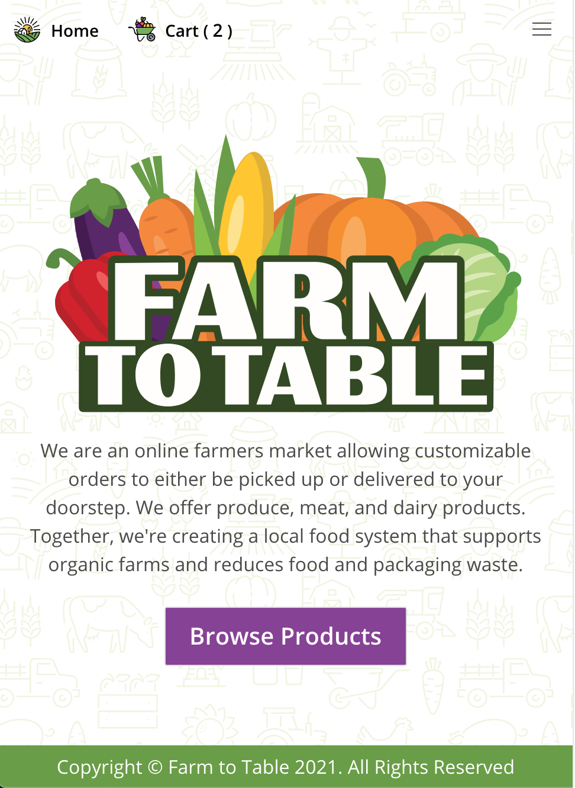

# **Farm to Table**
  
  
  ## **Table of Contents**
  * [Contributors](#contributors)
  * [Questions](#questions)
  * [License](#license)
  * [Credits](#credits)
      
  ## **Live Link**
  https://glacial-falls-13622.herokuapp.com/      
  ## **Description**
  Farm to Table is a web application that is also made to be highly mobile responsive. It currently connects users to a farm where they can reserve products like fresh meats, fruits, vegetables and dairies. The application is built with an admin side to allow the farmer who is selling their products be able to add, edit and delete what is for sale. The admin also has to ability to mark something as "Out of Season" which will keep the product in their database but will not display it to users. The application features a functioning cart that can be edited and updated dynamically. In the near future we hope to add the ability to have multiple farms able to set up accounts in our application to broaden products and their availability.
  ## **Demo**
  #### **Desktop/Laptop**
  

  #### **Mobile**
  

      
   ## **Contributors**
  * [Melanie Bostwick](https://github.com/mbostwick1)

  * [Stephany Bolivar](https://github.com/gstephbolivar)  

  * [Rashawn Raiford](https://github.com/raiford2530)
      
  * [Robert Anderson](https://github.com/reanderson89)

  * [Neil Gandhi](https://github.com/ntch2000)

  
  ## **Technology Stack**
  Server Side: javascript, bcrypt, .env, jsonwebtokens, mjml, node-sass, nodemailer, nodemon, nodemailer-express-handlebars, mongoose

  Client Side: javascript, axios, jsonwebtokens, mjml, node-sass, nodemailer-express-handlebars, prop-types, react, react-dom, react-router-dom, react-scripts, react-toastify, web-vitals, moment.js

  Database: MongoDB
  

  ## **Questions**   
  ####    **For any questions or inquiries please contact us at,**

**Melanie Bostwick**
  * #### **GitHub:** [@mbostwick1](https://github.com/mbostwick1)
  * #### **Email:** [mbostwick1@gmail.com](mbostwick1@gmail.com)

 **Stephany Bolivar**
  * #### **GitHub:** [@gstephbolivar](https://github.com/gstephbolivar)
  * #### **Email:** [g.stephanybolivar@gmail.com](g.stephanybolivar@gmail.com)
  
**Rashawn Raiford**
  * #### **GitHub:** [@raiford2530](https://github.com/raiford2530)
  * #### **Email:** [raiford87@gmail.com](raiford87@gmail.com)

**Robert Anderson**
  * #### **GitHub:** [@reanderson89](https://github.com/reanderson89)
  * #### **Email:** [reanderson89@gmail.com](reanderson89@gmail.com)

**Robert Anderson**
  * #### **GitHub:** [@ntch2000](https://github.com/ntch2000)
  * #### **Email:** [ngtych4@gmail.com](ngtych4@gmail.com)

  ## **Credits**
   * [Bulma](https://bulma.io/)
   * [Font awesome](https://fontawesome.com/)
   * [Bulma NavBar functionality](https://codepen.io/Nikitoss334/pen/VOEdVY)
  
    
  ## **License**
  MIT
      
